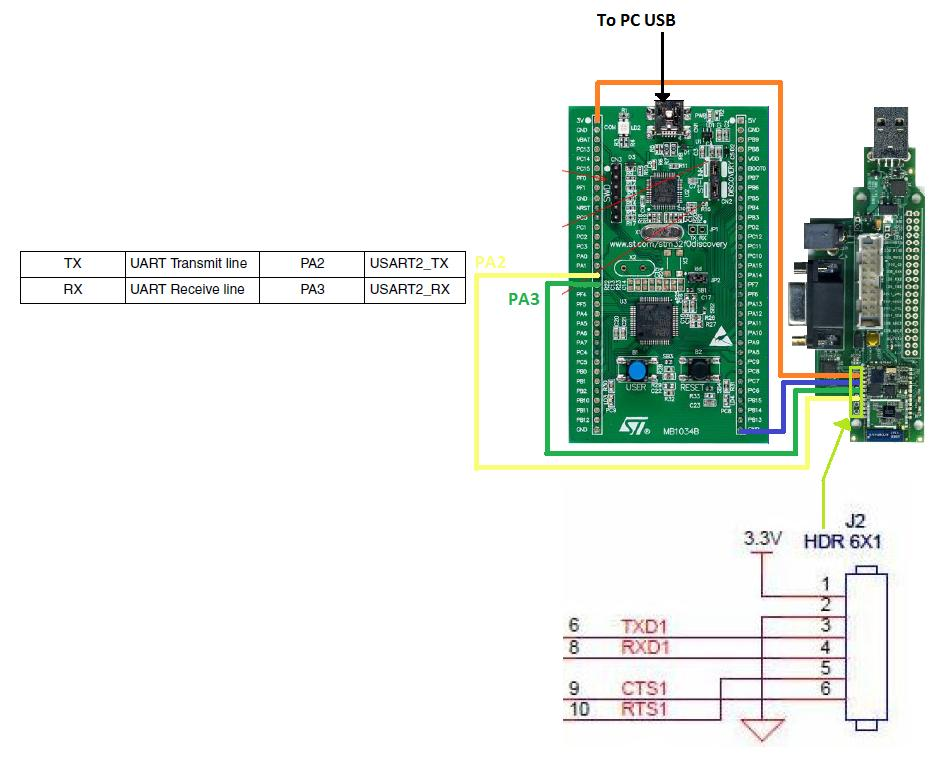
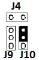
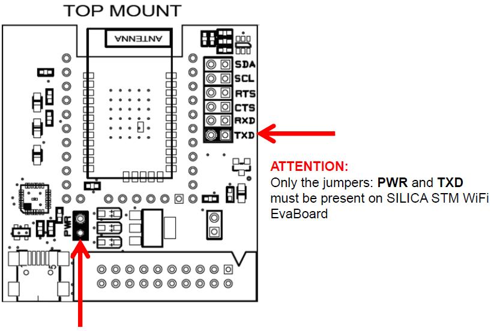
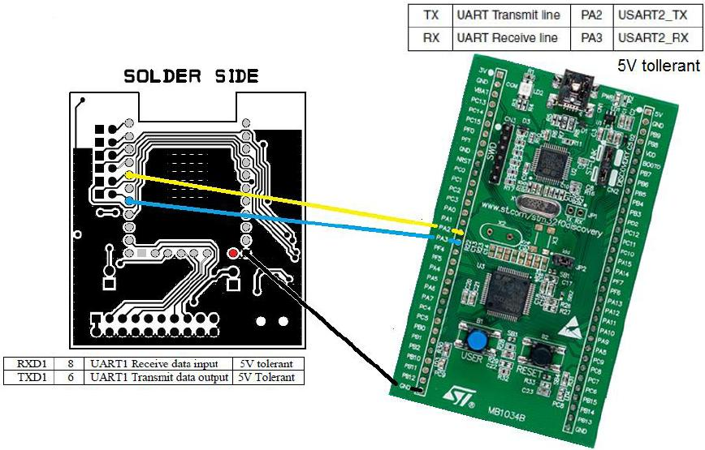
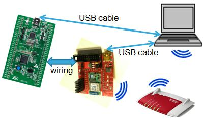
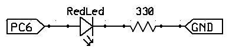
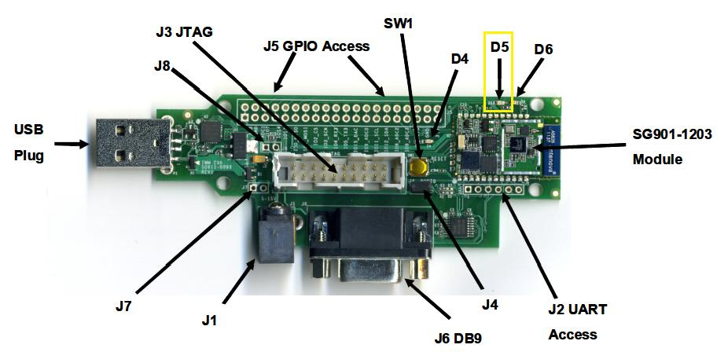
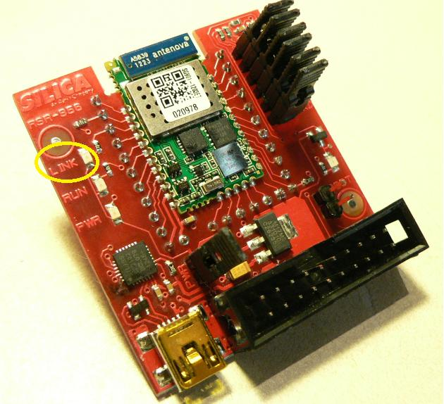
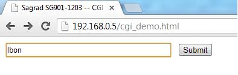
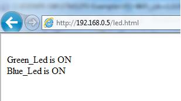

How to connect STM WiFi module to STM32F0-Discovery
===================================================

Connections for: SAGRAD EvaBoard
********************************

If you need to monitor the strings that are sent from STM32F0-Discovery and STM WiFi module do this:

Remove the jumper
**J9**
and
**J4**
, next connect the STM WiFi module to the
**Tera Term**
.

The connections are shown below for
**SILICA STM WiFi EvaBoard**
.

Connections for: SILICA STM WiFi EvaBoard
*****************************************

Optionally: RED led
*******************

if you connect a led (see schematic below)

from
**PC6**
and
**GND**
, you have the ability to monitor the waiting for the response from the STM WiFi module.

How to use the software
***********************

**For do the connection**
(after loaded the SW on STM32F0-Discovery)
**just press and release the**
**blue button**
on the STM32F0-Discovery.
At this point you see the
**Blue led**
that flashing and the
**Red led**
that changes from OFF to ON.

After some seconds,
**Blue**
and
**Green**
LED flash, and this means that the module STM WiFi is trying to connect to your WiFi router.

**After**
**2**
**0/60 sec**
,
**Blue**
and
**Green**
LEDs turn OFF and this means that the connection is made.

If you use the
**SAGRAD WiFi module**
, the
**led D5 must be ON**
, this means that the WiFi connection is active.

If you use the
**SILICA STM WiFi EvaBoard**
, the led
**LED2**
(LINK) must be ON, this means that the WiFi connection is active.

At this point, it is also loaded on the STM WiFi module, the html page named:
**led.hmtl**

**This page show the status of the LEDs mounted on the STM32F0-Discovery**
.

Now open the html page:
**cgi_demo.html**
this page is used to send commands to STM WiFi Module.

*   To do this you need to know the IP address of the STM WiFi module.

*   To find it I recommend you to use the
    **Angry IP Scanner**
    .

*   **Suppose the the STM WiFI IP is:**
    168.169.0.5

*   Open your browser and type:

    **192.168.0.5/cgi_demo.html**

The custom commands (implemented on STM32F0-Discovery) for control the STM WiFi module are:

*   **lgon**
    – TurnON the green LED

*   **lgoff**
    – TurnOFF the green LED

*   **lbon**
    – TurnON the blue LED

*   **lboff**
    – TurnOFF the blue LED

*   **X**
    – Clear RxBuffer

*   **reset**
    – reset the STM WiFi module, it reload the WiFi configuration

    received from STM32F0-Discovery.

    During the reset the Blue and Green Leds are flashing.

You have the possibility to see the LEDs status in the page:

**192.168.0.5/led.html**

Remember to reload the
**led.html **
page after each command sent using the
**cgi demo.html**
page.

