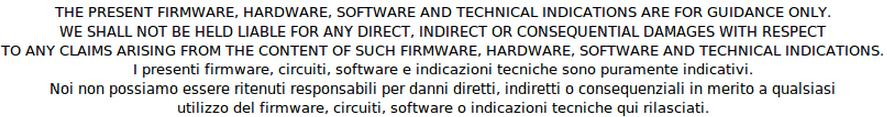

The documentation concerning FO-WiFi_Lib.v1.0.0
===============================================

:Version: 2.00
:Copyright: (C)2013 Silica an Avnet company
:Date: 13 november 2013

**We did this manual with maximum attention, but in any case:**

Introduction
************

The SW is based on
**STM32F0-Discovery**
and use the
**STM Library ver.1.0.0**

I developed the SW using
**KEIL C Compiler free version**
(
ver.4.60.0.0
) but I kept the structure of the STM library so is theoretically possible rebuild my project using:

Atollic, IAR and Tasking.

This SW is certainly not exhaustive but is intended to give you the basic functions to manage the STM WiFi module.

As improvements are recommended to implement error handling more in-depth than is currently implemented.

**Before to continue please see**
`this <http://www.emcu.it/SILICA-STDay-2013/HO_WebServer_VerForC.pdf>`_
**tutorial and read the manual:**
`STM_WiFi_info <http://www.emcu.it/WiFi/STM_WiFi_info.pdf>`_

See also here:

`http://www.emcu.it/WiFi/WiFi.html <http://www.emcu.it/WiFi/WiFi.html>`_

.. toctree::
 :maxdepth: 3
   
 STM32F0Discovery
 webpage
 variables
 definitions
 mainfunc

* :ref:`search`

