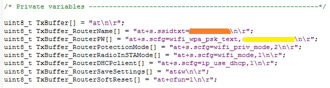

The important functions
=======================

The function below is used to configure the **PA0 in Input**.
At PA0 is connected the Blue Button that is located on the STM32F0-Discovery.

::

 void PA0_InFloating(void);

The function below is used to configure the **Output the pins: PC6, PC8 and PC9**.
On this pins are connected the Red the Blue and the Green Leds.

::

 void PC6PC8andPC9output(void);

The function below does a **delay** in mS.

::

 void Delay(__IO uint32_t nTime);
 Delay(500); // it does a delay of 500mS.

The function below is used to **find pBuffer2** (single character) **in pBuffer1**.

Remember that:

*   **pBuffer2**
    must be a single character

*   **pBuffer1**
    normally is the RxBuffer

::

 uint8_t BuffOneCH(uint8_t* pBuffer1, uint8_t* pBuffer2, uint16_t BufferLength);

This function returns:

*   **PASS**
    if pBuffer2 is present in pBuffer1

*   **FAIL**
    if pBuffer2 is not present in pBuffer1

The function below is used for **clear ** the ** pBuffer**.

::

 static void Fill_Buffer(uint8_t *pBuffer, uint16_t BufferLength);

The function below is used to see if: **pBuffer2 is in pBuffer1**.

It's the main search function used in this SW.

::

 uint8_t Search_B2inB1(uint8_t* pBuffer1, uint8_t* pBuffer2, uint16_t Buffer1Length, uint16_t Buffer2Length);

This function returns:

*   **PASS** if pBuffer2 is present in pBuffer1

*   **FAIL** if pBuffer2 is not present in pBuffer1

The function below does the **configuration of the USART2**.

::

 void STM_EVAL_COM_2_Init(USART_InitTypeDef* USART_InitStruct);

Remember, before you call this function, you must:

*   Declare: USART_InitTypeDef USART_InitStructure;

*   Configure the parameters of the USART

See below.

::

 USART_InitTypeDef USART_InitStructure;
 /* USARTx configuration ------------------------------------------------------*/
 /* USARTx configured as follow:
    - BaudRate = 115200 baud
    - Word Length = 8 Bits
    - One Stop Bit
    - NO parity
    - NO hardware flow control
    - Receive and transmit enabled
 */

 USART_InitStructure.USART_BaudRate = 115200;
 USART_InitStructure.USART_WordLength = USART_WordLength_8b;
 USART_InitStructure.USART_StopBits = USART_StopBits_1;
 USART_InitStructure.USART_Parity = USART_Parity_No;
 USART_InitStructure.USART_HardwareFlowControl USART_HardwareFlowControl_None;
 USART_InitStructure.USART_Mode = USART_Mode_Rx | USART_Mode_Tx;
 STM_EVAL_COM_2_Init(&USART_InitStructure);

**This function is not used**, but I left because it can be useful for some future application.

The function below is used for find: pBuffer2 in pBuffer1.
First is searched the first character of pBuffer2 in pBuffer1.
Next the comparisons continue until the end of the length
of pBuffer2 or the first difference of the two buffers.

::

 uint8_t SearchBuffer2inBuffer1(uint8_t* pBuffer1, uint8_t* pBuffer2, uint16_t Buffer1Length, uint16_t Buffer2Length);

This function return:

*   **PASSED**
    if pBuffer2 is present in pBuffer1

*   **FAILED**
    if pBuffer2 is not present in pBuffer1

The function below is used for **configure the STM WiFi module**.

::

 uint8_t ConfigureWiFi(void);

It send to STM WiFi module:

*   **Router Name**
    and test the OK answer from STM WiFi module

*   **Router Password**
    and test the OK answer from STM WiFi module

*   **Router Potection Mode**
    and test the OK answer from STM WiFi module

*   **Router Radio in STA Mode**
    and test the OK answer from STM WiFi module

*   **Router DHCP Client**
    and test the OK answer from STM WiFi module

*   **Save Settings**
    and test the OK answer from STM WiFi module

*   **Turn LEDs**
    (Blue and Green on STM32F0-Discovery) to flashing

*   **Router Soft Reset**

*   **Wait until the WiFi Connection **
    **is OK**
    (test the answer → :WiFi Up: (WiFi_IP))

*   **Prepare the HTML page**
    named
    **LED.HTML**
    and test the OK answer from STM WiFi module

*   **Prepare to UpLoad**
    the
    **LED.HTML**
    page and test the OK answer from STM WiFi module

*   **UpLoad **
    the
    ** LED.HTML**
    page
    and test the OK answer from STM WiFi module

*   **Turn OFF **
    the
    ** LEDs**
    (Blue and Green on STM32F0-Discovery)

This function return:

*   **PASS**
    if WiFi connection is OK

*   **FAIL**
    if WiFi connection is FAIL

.. warning::

 In the **main.c** there are definitions of strings used to connect the STM WiFi module to your WiFi Router.
 **Remember to configure the parameters in according to your WiFi network.**

In particular, be sure to specify:

*   **Router Name**
    (see the orange line below)

*   **Router Password**
    (see the yellow line below – password)

For example:

::

 uint8_t TxBuffer_RouterName[] = "at+s.ssidtxt=NETGEAR-3G\n\r";
 uint8_t TxBuffer_RouterPW[] = "at+s.scfg=wifi_wpa_psk_text, free\n\r";

The function below is used for
**check the commands received from STM WiFi module and if they are correct apply them**. Also **test some STM WiFi module errors**.

::

 void TestRxCommand(void);

Until now commands accepted are:

*   **lgon**
    – TurnON the green LED

*   **lgoff**
    – TurnOFF the green LED

*   **lbon**
    – TurnON the blue LED

*   **lboff**
    – TurnOFF the blue LED

*   **X**
    – Clear RxBuffer

*   **reset**
    – STM32F0-Discovery reload the WiFi configuration to the STM WiFi module.

    During the reset, the Blue and Green Leds are flashing.

The STM WiFi module errors that (up to now) are tested are:

*   Test if received fromSTM WiFI:
    **+WIND:42:RX_MGMT:**
    - Unhandled Event: - From network means FAIL.
    Variable → TxBuffer_FAIL1

*   Test if received fromSTM WiFI:
    **+WIND:43:RX_DATA:**
    - Unhandled Event: - From
    network means FAIL
    Variable → TxBuffer_FAIL2

*   Test if received fromSTM WiFI:
    **+WIND:44:RX_UNK:**
    - Unhandled Event: - From network means FAIL
    Variable → TxBuffer_FAIL3

*   Test if received fromSTM WiFI:
    **+WIND:34:WiFi**
    - Unhandled Event: - From network means FAIL
    Variable → TxBuffer_FAIL4

*   Test if received fromSTM WiFI:
    **ERROR:**
    - From network means FAIL
    Variable → TxBuffer_FAIL5

in case of errors is called the function:

::

 ResetSTMWiFIModule_retainsLEDs();

| The function below is used for
| **upload into the STM WiFi module the appropriate led.html** **page**.
| To perform this function, **LoadAppropite_LedPage**, check the value of:
| **LedG** and **LedB**.

::

 void LoadAppropite_LedPage(void);

The function below **IS NOT USED**.

I left this function in software for future implementations.

The function below is used for ** reset the STM WiFi module.**

This charging's last loaded configuration to the module STM WiFI and clears the RxBuffer.

::

 void ResetSTMWiFIModule(void)

The function below is used for ** reset the STM WiFi module but retains the status of the LEDs.**

This function call the: ConfigureWiFi();

::

 void ResetSTMWiFIModule_retainsLEDs(void)

**ATTENTION**

At the end of this funtion there is the line:

::

 LGflash=1; // Green LED flashing

In the final application, this line, should be REMOVED.

Please visit:
`www.emcu.it <http://www.emcu.it/>`_

